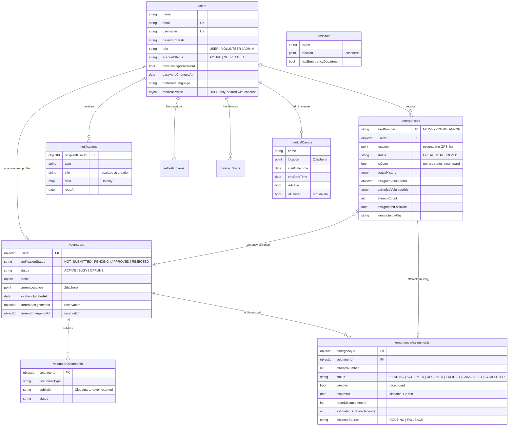

# 08 — Database Design

MongoDB collections:

## users
All accounts (USER, VOLUNTEER, ADMIN) live here (DECISIONS P-03).
- _id
- name
- email (unique)
- username (unique)
- passwordHash (never returned)
- phone (optional)
- role = USER | VOLUNTEER | ADMIN
- accountStatus = ACTIVE | SUSPENDED (applies to every role, P-02)
- preferredLanguage = en | hi | mr
- mustChangePassword (admin-created volunteers)
- medicalProfile { dateOfBirth, gender, bloodGroup, allergies, medicalConditions, emergencyContactName, emergencyContactPhone, shareWithResponders }
- lastLoginAt, passwordChangedAt, suspendedAt, suspendedBy
- createdAt
- updatedAt

## volunteers
- _id
- userId (1:1 with a VOLUNTEER user)
- profile { phone, dateOfBirth, gender, address, city, languages[], skills[], emergencyContactName, emergencyContactPhone }
- profileCompleted
- verificationStatus = NOT_SUBMITTED | PENDING | APPROVED | REJECTED
- submittedAt, verifiedBy, verifiedAt, rejectionReason
- status (operational) = OFFLINE | ACTIVE | BUSY
- statusChangedAt
- currentLocation { type: Point, coordinates: [lng, lat] } (pure GeoJSON, D-023)
- locationUpdatedAt, locationAccuracy
- currentAssignmentId / currentEmergencyId (reservation, null when free — P-04)
- lastActiveAt
- createdBy
- createdAt
- updatedAt

Documents are stored in the separate `volunteerDocuments` collection.

## volunteerDocuments
Can be embedded or separate depending on document workflow:
- _id
- volunteerId
- documentType
- cloudinaryPublicId
- secureUrl
- originalName
- status
- uploadedAt
- reviewedAt
- reviewNote

## emergencies
- _id
- alertNumber
- userId
- location { type: Point, coordinates: [lng, lat] }
- locationAccuracy
- message/summary
- status
- assignedVolunteerId
- createdAt
- assignedAt
- acceptedAt
- resolvedAt
- resolutionNote

## emergencyAssignments
- _id
- emergencyId
- volunteerId
- attemptNumber
- routeDistance
- estimatedDuration
- status
- dispatchedAt
- expiresAt
- acceptedAt
- rejectedAt
- expiredAt

## medicalCamps
- _id
- name
- description
- location { type: Point, coordinates: [lng, lat] }
- address
- services[]
- contact
- startDateTime
- endDateTime
- isActive
- createdBy
- createdAt
- updatedAt

## hospitals
- _id
- name
- location
- address
- contact
- services[]
- source/provider metadata
- isActive

## notifications
- _id
- recipientUserId
- type
- title
- body
- data
- readAt
- createdAt

## Implementation additions (Phase 2)
- `emergencies`: `isOpen`, `statusHistory[]`, `currentAssignmentId`, `attemptCount`, `excludedVolunteerIds[]`, `assignmentLockUntil`, `idempotencyKey`, `startedAt`, `resolvedBy`, `cancelledAt`, `cancelledBy`, `cancelReason`, `unassignedAt`. `location` is optional (SOS without a GPS fix).
- `emergencyAssignments`: `isActive`, `distanceSource` (ROUTING | FALLBACK), `declinedAt` (instead of `rejectedAt`), `cancelledAt`, `completedAt`, `expiryWarningSentAt`, `endReason`, `assignedBy`. Status = PENDING | ACCEPTED | DECLINED | EXPIRED | CANCELLED | COMPLETED.
- `volunteerDocuments`: stores `publicId`, `resourceType`, `deliveryType`, `mimeType`, `sizeBytes`; files are private in Cloudinary and viewed via short-lived signed URLs (no stored public URL).
- `medicalCamps`: `contact { name, phone }`, `isDeleted`/`deletedAt` (soft delete), `updatedBy`.
- `hospitals`: `hasEmergencyDepartment`, `source { provider: DEMO_SEED | OSM | MANUAL, externalId }`.
- New collections: `refreshTokens` (hashed, rotating, TTL), `deviceTokens` (FCM), `counters` (alert numbers).

## Indexes
Race guards (partial unique indexes, D-022):
- one open emergency per user: `emergencies { userId }` where `isOpen: true`
- one active assignment per emergency: `emergencyAssignments { emergencyId }` where `isActive: true`
- one active assignment per volunteer: `emergencyAssignments { volunteerId }` where `isActive: true`

Use geospatial 2dsphere indexes on:
- volunteers.currentLocation
- medicalCamps.location
- hospitals.location

Use indexes for:
- emergency status
- emergency assignedVolunteerId
- volunteer verificationStatus + status
- assignment emergencyId + status
- camp start/end times

Never store raw passwords or unnecessary sensitive documents in MongoDB.

---

## Entity relationships (V1)

Uniqueness that protects the dispatch rules (D-022): one open emergency per user, one active
assignment per emergency, and one active assignment per volunteer — all partial unique indexes,
so the database refuses a double assignment even if the code were wrong.
