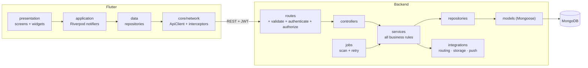

# 10 — System Architecture

```text
Flutter Applications
 ├── User experience
 ├── Volunteer experience
 └── Admin experience
          |
       REST API
          |
Node.js + Express
 ├── Auth
 ├── Users
 ├── Volunteers
 ├── Emergencies
 ├── Assignment Engine
 ├── Camps
 ├── Facilities
 ├── Notifications
 └── Admin
          |
 ┌────────┼───────────┐
 MongoDB Cloudinary   FCM
          |
 OpenStreetMap + OpenRouteService
```

## Architectural principles
- Presentation, state, domain and data responsibilities remain separated.
- Backend contains business rules and authorization.
- Flutter never directly accesses MongoDB or Cloudinary management credentials.
- Assignment engine is a backend service.
- External providers are wrapped behind interfaces/services.

---

## V1 implementation (Phase 12)

### Layers



Rules that keep the layers honest, each enforced by a test:
- Widgets never call the API: presentation code may not import dio or `ApiClient`.
- Controllers contain no business rules; services never touch `req`/`res`.
- Services reach the database through repositories only.
- Every external provider sits behind an interface with a test seam:
  `RoutingService`, `DocumentStorage`, `PushProvider`, and on the app side `LocationService`,
  `DocumentPicker`, `PushService`.

### Request path
`route → validate (Joi) → authenticate (reload account) → authorize (role + forced password
change) → controller → service (+ repositories, transactions) → response envelope`.
Errors travel as `AppError` with a language-neutral code and are turned into the standard error
envelope by one error handler (doc 23).

### Background work
One instance runs the scheduler (P-06). Both jobs are database-driven and idempotent, so a
restart loses nothing and a second instance would not corrupt state:
- `assignment-scan` every 10 s: expiry warnings and acceptance timeouts → reassignment.
- `unassigned-retry` every 30 s: alerts still waiting for a volunteer.

### Real-time updates (P-09)
Push (FCM) plus polling, with no WebSockets: live screens poll every 5 s (10 s on admin lists,
60 s for route and ETA, 30 s for the notification badge). Polling stops when a screen is left.

### Resilience
| If this is missing | What happens |
|---|---|
| OpenRouteService | Straight-line estimates, flagged `FALLBACK` and labelled in the app |
| Firebase | In-app notifications only; polling keeps screens live |
| Cloudinary | Document upload is unavailable; nothing else is affected |
| GPS fix | The alert is still created and escalated to admins |
| Network (app) | The session survives; live screens keep their last data and retry |
