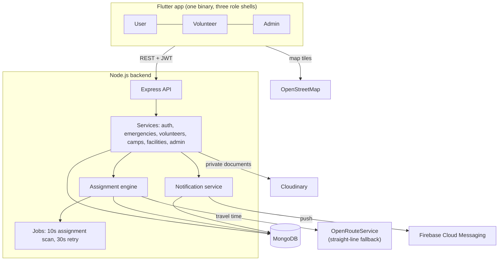

# MedAID

Emergency health assistance for large gatherings such as Kumbh. A person in trouble raises an
alert with one press; the backend finds the nearest available verified volunteer and dispatches
them within seconds; a control room watches every alert and steps in when nobody responds.

Three roles share one app:

| Role | What they do |
|---|---|
| **User** | Symptom guidance, nearby hospitals and medical camps, one-press SOS, live status of their alert |
| **Volunteer** | Onboarding and document verification, availability, receiving and responding to emergencies, route and ETA |
| **Admin** | Verifying volunteers, monitoring and reassigning emergencies, managing camps and accounts, reports |

Flutter (Riverpod, GoRouter) · Node.js + Express · MongoDB · OpenStreetMap + OpenRouteService ·
Cloudinary · Firebase Cloud Messaging. English, Hindi and Marathi.

---

## How it fits together



The app never talks to MongoDB, Cloudinary, OpenRouteService or any API key: business rules,
authorization and provider keys all live on the backend.

### What happens when someone presses SOS

```mermaid
sequenceDiagram
    participant U as User app
    participant API as Backend
    participant E as Assignment engine
    participant V as Volunteer app
    participant Ad as Admin

    U->>API: POST /emergencies (location, Idempotency-Key)
    API-->>U: alert created
    API->>E: request assignment
    E->>E: eligible volunteers nearby, ranked by travel time
    E->>V: assignment (2 minutes to accept)
    alt accepted in time
        V->>API: accept
        API-->>U: "help is on the way" + responder and ETA
        V->>API: arrived, then resolve
        API-->>U: resolved; volunteer becomes available again
    else no answer
        E->>E: expire, exclude, dispatch the next volunteer
        E->>Ad: escalate after repeated timeouts
    end
```

---

## Repository layout

```text
medaid/
├── backend/               Express API, assignment engine, jobs, tests
│   ├── src/               config, models, repositories, services, routes, integrations
│   ├── scripts/           seed-admin.js, seed-demo.js
│   └── tests/             integration + unit suites
├── frontend/              Flutter app
│   └── lib/               app (router, l10n), core (theme, network, widgets), features, shared
├── MedAID_Documentation/  the specification (27 documents) — the source of truth
├── PROJECT_PLAN.md        phase plan, open questions, contradictions found in the docs
├── DECISIONS.md           every decision taken, with its reason
└── DEVELOPMENT_STATUS.md  what is built, phase by phase
```

---

## Running it

**Prerequisites:** Node.js 22.12+, Flutter 3.44+ (Dart 3.12), and a MongoDB database.
The engine uses transactions, so MongoDB must be a replica set — MongoDB Atlas (free tier) is the
easiest option.

### Backend

```bash
cd backend
npm install
cp .env.example .env      # then fill in MONGODB_URI and the two JWT secrets
npm run seed:admin        # first admin, from the ADMIN_SEED_* values in .env
npm run dev               # http://localhost:5000/api/v1/health
```

Required in `.env`: `MONGODB_URI` and `JWT_ACCESS_SECRET` (32+ characters — generate one with
`node -e "console.log(require('crypto').randomBytes(48).toString('hex'))"`). Everything else has a
working default. Refresh tokens are random strings stored as hashes, so they need no secret.

If port 5000 is taken on your machine, set `PORT=5001` in `.env` and point the app at that
port (see below).

### Flutter app

```bash
cd frontend
flutter pub get
flutter run
```

Where the app looks for the backend, in order:

1. `--dart-define=API_BASE_URL=...`, if given — always wins, and is how release builds are told
   their real server.
2. Otherwise, in debug builds, `AppConfig.devApiBaseUrl` in
   [`lib/core/constants/app_config.dart`](frontend/lib/core/constants/app_config.dart). **Set that
   once for your setup** and plain `flutter run` works:
   - physical phone: your computer's Wi-Fi address, e.g. `http://192.168.1.10:5001/api/v1`
     (`ipconfig` on Windows), with both devices on the same network
   - Android emulator: `http://10.0.2.2:5001/api/v1`
   - iOS simulator or desktop: `http://localhost:5001/api/v1`

The address is baked in when the app is built, so after changing it — or after your Wi-Fi address
changes — run the app again rather than hot reloading.

### Demo data

```bash
cd backend && npm run seed:demo
```

Creates clearly labelled demo hospitals, camps (one open now, one upcoming, one finished),
four volunteers and one user around Ramkund in Nashik. Every demo account uses the password
`DemoPass123` (override with `SEED_DEMO_PASSWORD`). Safe to run repeatedly.

Demonstrating somewhere else on a real phone? Place the data around you instead:

```bash
SEED_DEMO_LAT=19.9975 SEED_DEMO_LNG=73.7898 npm run seed:demo
# PowerShell: $env:SEED_DEMO_LAT="19.9975"; $env:SEED_DEMO_LNG="73.7898"; npm run seed:demo
```
See **[DEMO.md](DEMO.md)** for the end-to-end walkthrough.

---

## Optional integrations

The system runs without any of these; each degrades gracefully.

| Integration | Without it | To enable |
|---|---|---|
| **OpenRouteService** | Straight-line distance and ETA estimates, marked as estimates in the app | `ORS_API_KEY` |
| **OpenStreetMap hospitals** | On by default and needs no key: real hospitals near the user are fetched from the Overpass API and cached. Turn off with `OSM_HOSPITAL_SYNC=false`, and only seeded or admin-entered hospitals are shown | — |
| **Cloudinary** | Volunteer document upload is unavailable; everything else works | `CLOUDINARY_*` |
| **Firebase (push)** | In-app notifications only, refreshed by polling. Alerts still ring, but only reach a volunteer whose app is running | Free; step by step in **[DEPLOYMENT.md](DEPLOYMENT.md)**. Backend: `FCM_SERVICE_ACCOUNT_PATH`. App: `ENABLE_PUSH` plus the four `FIREBASE_*` values |

---

## Tests and quality gates

```bash
cd backend   && npm test && npm run lint && npm run format:check   # 470 tests
cd frontend  && flutter test && flutter analyze                    # 116 tests
```

The backend suite runs against an in-memory MongoDB replica set, so no database is needed.
It covers the assignment engine (including the twelve critical cases in doc 24 and the race
conditions), an authorization matrix over every endpoint, and the security checks in doc 22.

---

## Troubleshooting

| Symptom | Cause and fix |
|---|---|
| Backend exits with `"MONGODB_URI" is required` | No `.env`. Copy `.env.example` to `.env` and fill it in. |
| Backend exits with `EADDRINUSE` on 5000 | Something else holds the port (on Windows often the `System` process). Set `PORT=5001` in `.env` and use that port in `AppConfig.devApiBaseUrl`. |
| Atlas connection fails with `tlsv1 alert internal error` | Your IP is not in Atlas → **Network Access**, or the cluster is paused. Add your IP and resume the cluster. |
| Everything lands in a `test` database | The connection string has no database name. It must read `.../medaid?retryWrites=true&w=majority`. |
| App shows a network error on a **physical phone** | `10.0.2.2` only exists on the Android emulator. Put the computer's LAN address in `AppConfig.devApiBaseUrl` (or pass `--dart-define=API_BASE_URL=...`), with both devices on the same Wi-Fi and the backend allowed through the firewall. |
| `CLEARTEXT communication not permitted` | Debug builds allow plain HTTP through `android/app/src/debug/AndroidManifest.xml`. Release builds require HTTPS, by design. |
| Gradle fails with `Could not close incremental caches in build/android_file_picker/...` | A Kotlin 2.3 compiler-daemon bug on Windows. `android/gradle.properties` disables incremental compilation and compiles in-process; if it reappears, run `flutter clean` and `cd android && ./gradlew --stop`. |

## Where to read more

- **[MedAID_Documentation/](MedAID_Documentation/)** — the specification. Start with
  `01_PROJECT_OVERVIEW.md`, then `07_EMERGENCY_ASSIGNMENT_ENGINE.md` (the heart of the system),
  `09_API_SPECIFICATION.md` and `08_DATABASE_DESIGN.md`. Each implemented area has a
  "V1 implementation" section describing what was actually built.
- **[PROJECT_PLAN.md](PROJECT_PLAN.md)** — the phase plan, plus the contradictions and open
  questions found while reviewing the specification.
- **[DECISIONS.md](DECISIONS.md)** — every decision and its reasoning.
- **[DEVELOPMENT_STATUS.md](DEVELOPMENT_STATUS.md)** — what exists today, phase by phase.
- **[DEPLOYMENT.md](DEPLOYMENT.md)** — putting the backend on Render, setting up Firebase
  Cloud Messaging, and building an APK to share.

## Before this is used for real

- The symptom guidance content is rule-based and conservative, and is marked
  **PENDING_CLINICAL_REVIEW**. It must be reviewed by a clinician. It is guidance, never a
  diagnosis, and never replaces calling 112.
- The Hindi and Marathi translations need a native-speaker review.
- Volunteer and Admin screens are English in V1 (the User flow is fully translated).
